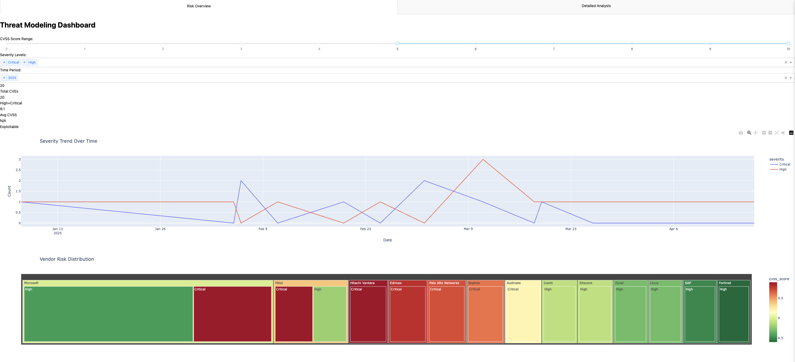
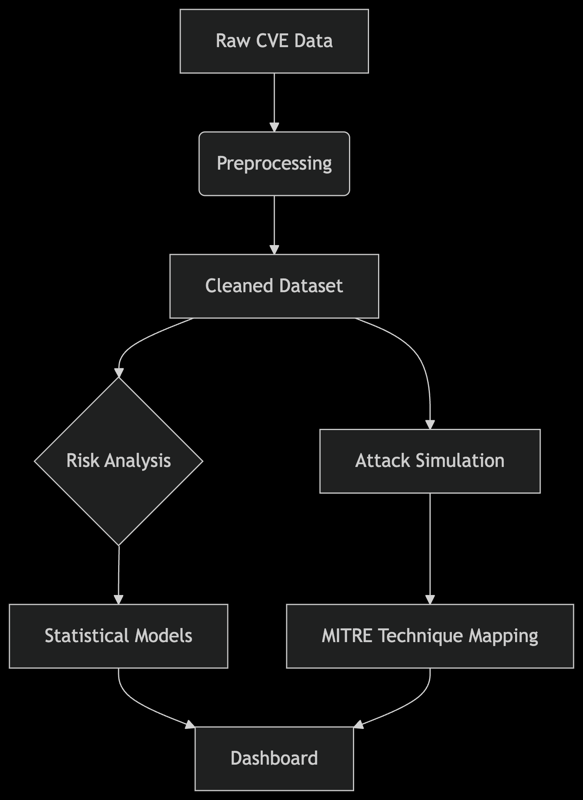

# Threat-Modeling-Risk-Analysis-Lab-with-R
# Real-Time CVE Analysis Pipeline
Analyzes NVD data to quantify risks and map MITRE ATT&CK techniques.

# Threat Modeling & Risk Analysis Lab


A quantitative threat modeling pipeline with attack path simulation and interactive risk dashboard, powered by CVE data and MITRE ATT&CK framework.



## Features

### 🔍 Core Analysis
- **Automated CVE Processing**: Ingest and preprocess NVD/CVE data
- **Risk Scoring**: Logistic regression + chi-square analysis
- **Attack Simulation**: MITRE ATT&CK technique mapping
- **Temporal Analysis**: Vulnerability aging trends

### 📊 Interactive Dashboard
- **Multi-tab Interface**: Overview + detailed analysis
- **Smart Filters**: CVSS score, severity, vendor, time period
- **Advanced Visualizations**:
  - Treemap of vendor risk distribution
  - Technique frequency word cloud
  - Time-series severity trends
- **Export Ready**: CSV/PDF report generation

### 🛡️ Enterprise-Ready
- Docker container support
- CI/CD pipeline integration
- Role-based access control (optional)
- Automated alerting system

## Quick Start

### Prerequisites
- Python 3.10+
- PostgreSQL (for production)
- ChromeDriver (for testing)

### Installation
```bash
# Clone repo
git clone https://github.com/yourusername/threat-modeling-lab.git
cd threat-modeling-lab

# Create virtual environment
python -m venv venv
source venv/bin/activate  # Linux/Mac
venv\Scripts\activate     # Windows

# Install dependencies
pip install -r requirements.txt

# Download MITRE ATT&CK data
wget https://raw.githubusercontent.com/mitre/cti/master/enterprise-attack/enterprise-attack.json -P data/
```


